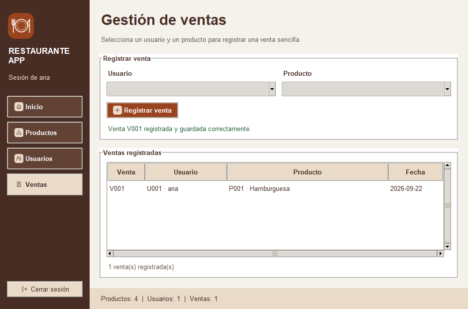

# Restaurante App · Semana 15

**Conceptos fundamentales de manejo de eventos con Tkinter**

| Información académica | Dato |
| --- | --- |
| Estudiante | Juan David Rivadeneira Cuascota |
| Universidad | Universidad Estatal Amazónica |
| Asignatura | Programación Orientada a Objetos |
| Docente | Kevin Bolívar Lascano Sánchez |
| Semestre y paralelo | Segundo semestre · F |
| Código del curso | 2626-UEA-L-UFB-030-F |
| Semana | 15 |

## Propósito

Esta versión continúa restaurante_app e incorpora una venta sencilla que relaciona
**un usuario registrado + un producto registrado + la fecha**. Demuestra cómo
un botón inicia una operación con command=, cómo el callback coordina con el
servicio y cómo el resultado guardado se presenta inmediatamente en la interfaz.

La captura se obtuvo ejecutando la aplicación con datos temporales de prueba.
El archivo ventas.json de la entrega inicia vacío, listo para registrar ventas.

## Ejecución y acceso

Requisitos: **Python 3.10 o superior con Tkinter** y un entorno gráfico.
La aplicación usa únicamente la biblioteca estándar. No requiere instalar
paquetes con pip ni conexión a Internet durante su uso.

Desde la raíz del repositorio, ejecutar:

    python restaurante_app/main.py

En Windows también se puede usar:

    py restaurante_app/main.py

Si la terminal está dentro de restaurante_app:

    python main.py

Se verificó con Python 3.14.3 en Windows.
**Usuario de demostración: ana · Contraseña: 1234.**

1. Iniciar sesión y abrir **Ventas**.
2. Seleccionar **U001 · ana** y **P001 · Hamburguesa**.
3. Pulsar **Registrar venta**.
4. Observar la confirmación, la nueva fila y el contador.
5. Cerrar la ventana y ejecutar nuevamente: la venta permanece.

Las rutas se calculan desde los archivos del proyecto, sin depender de la
carpeta desde la que se abre la terminal.

## Continuidad del proyecto

La base es la [Semana 14](https://github.com/DavidRivadeneira/POO-Semana-14-Restaurante),
que continúa la [Semana 13](https://github.com/DavidRivadeneira/POO-Semana-13-Restaurante).
Se conserva su historial de Git: **8f569a4** es la versión publicada de Semana 14.
El commit **ebc4542** conserva el producto P004 agregado en la copia local.
La Semana 15 evoluciona esa base.

| Elemento | Semana 14 | Semana 15 |
| --- | --- | --- |
| Arquitectura | datos, modelos, servicios, ui y main.py | Mismas capas; se añaden Venta, ventas.json y recursos de presentación. |
| Acceso | LoginView y validación en el servicio | Se conserva y se integra el logo. |
| Usuarios | Consulta en tabla sin contraseñas | Se conserva; se permite elegir el usuario de una venta. |
| Productos | Registrar, cargar por código, actualizar, eliminar y limpiar | Todas las operaciones se conservan y se integran íconos. |
| Ventas | Opción pendiente | Formulario, callback, validaciones, guardado y tabla. |
| Diseño | Paleta terracota y crema, menú lateral y tablas | Misma identidad, logo, íconos y contador de ventas. |
| Persistencia | usuarios.json y productos.json | Se conserva y se añade ventas.json. |

Los modelos Usuario y Producto y el servicio de archivos se conservan.
Los JSON de usuarios y productos parten de la versión local de Semana 14,
incluido **P004 · Coca Cola**. Cada semana tiene su propia carpeta de datos.

## Estructura

    Repositorio/
    ├── README.md
    ├── .gitignore
    ├── tests/
    │   └── test_restaurante.py
    ├── docs/
    │   └── evidencias/
    │       ├── login.png
    │       ├── productos.png
    │       └── ventas.png
    └── restaurante_app/
        ├── README.md
        ├── main.py
        ├── datos/
        │   ├── productos.json
        │   ├── usuarios.json
        │   └── ventas.json
        ├── modelos/
        │   ├── __init__.py
        │   ├── producto.py
        │   ├── usuario.py
        │   └── venta.py
        ├── servicios/
        │   ├── __init__.py
        │   ├── archivo_servicio.py
        │   └── restaurante_servicio.py
        ├── ui/
        │   ├── __init__.py
        │   ├── login_view.py
        │   ├── main_view.py
        │   └── recursos.py
        └── assets/
            ├── README.md
            ├── icons/    (diez íconos PNG y sus originales SVG)
            └── logo/     (logo.png, menu.png, icono.png y logo.svg)

| Capa o archivo | Responsabilidad |
| --- | --- |
| modelos/ | Representar usuarios, productos y ventas; validar el formato de sus atributos. |
| restaurante_servicio.py | Validar acceso, gestionar productos, comprobar reglas de ventas y solicitar su guardado. |
| archivo_servicio.py | Leer y escribir JSON. No conoce widgets ni reglas del restaurante. |
| datos/ | Conservar registros entre ejecuciones. |
| ui/ | Capturar entradas, coordinar callbacks y presentar resultados. No lee ni escribe JSON. |
| ui/recursos.py | Cargar imágenes de assets con PhotoImage. |
| assets/ | Recursos visuales incluidos y utilizados por la interfaz. |
| main.py | Crear servicios y una única ventana Tk; alternar vistas con un solo mainloop. |

## command y callback

Un **evento** es una acción que provoca una respuesta. Aquí la acción es pulsar
un botón. Un **callback** es el método que Tkinter ejecuta al ocurrir esa acción.
El mainloop mantiene la ventana atendiendo la interacción.

En MainView.mostrar_ventas() el botón se asocia mediante:

    command=self.registrar_venta

Se entrega la referencia **sin paréntesis**. Escribir
command=self.registrar_venta() ejecutaría el método al construir el botón,
en lugar de esperar la acción del usuario.

    Usuario pulsa Registrar venta
        → command=self.registrar_venta
        → MainView.registrar_venta() obtiene las selecciones
        → RestauranteServicio.registrar_venta(usuario_id, producto_codigo)
        → valida que ambas selecciones existan
        → crea Venta con identificador y fecha
        → ArchivoServicio.escribir_json("ventas.json", datos)
        → confirma la nueva colección en memoria
        → callback limpia selectores y actualiza tabla, contador y mensaje

Hay dos métodos registrar_venta, en clases distintas: **el de la vista coordina
la interacción; el del servicio ejecuta la operación**. La llamada que los une:

    venta = self.restaurante_servicio.registrar_venta(usuario_id, producto_codigo)

El callback obtiene las claves mediante diccionarios que relacionan cada opción
visible con su identificador. No divide nombres ni interpreta sus separadores.
La vista no verifica la existencia de entidades ni escribe archivos.
Si el servicio produce ValueError, el callback muestra el mensaje y conserva
las selecciones para corregirlas o reintentar.

## Gestión y persistencia de ventas

Los selectores son **ttk.Combobox de solo lectura**, cargados desde el servicio
al entrar en Ventas. Los registros aparecen en un **ttk.Treeview** con barras
de desplazamiento. Si faltan usuarios o productos, se informa y el botón queda
deshabilitado; el servicio también valida cuando se lo llama directamente.

El servicio exige selecciones no vacías y entidades existentes. Genera el
identificador a partir del mayor número guardado y obtiene la fecha local del
equipo en formato ISO. Ejemplo del formato, **no precargado en la entrega**:

    {
        "identificador": "V001",
        "usuario_id": "U001",
        "producto_codigo": "P001",
        "fecha": "2026-09-22",
        "usuario_nombre": "ana",
        "producto_nombre": "Hamburguesa"
    }

Las claves mantienen la relación. Los nombres son copias del momento de la
operación: una venta anterior sigue siendo comprensible si se renombra o elimina
el producto. Venta es una dataclass inmutable que representa ese registro.

- Al iniciar se carga ventas.json y se reconstruyen objetos Venta.
- El servicio guarda la nueva colección antes de reemplazar el estado en memoria.
  Un fallo de escritura no genera una venta ficticia.
- ArchivoServicio escribe un temporal y reemplaza el JSON al terminar.
  Informa errores y limpia el temporal si corresponde.
- Un archivo ausente, JSON dañado, campos inválidos o identificadores repetidos
  detienen el inicio con un aviso. No se sustituyen automáticamente por listas vacías.
- La venta registra la relación solicitada y **no modifica precio ni stock**.
  El stock sigue administrándose desde Productos.
- Cada pulsación válida registra una venta; después se vacían los selectores.

La práctica no incorpora facturación, carrito, inventario avanzado ni bases
de datos. Tampoco añade bind(), doble clic, eventos propios de teclado o mouse,
<<TreeviewSelect>> ni carga reactiva de filas. Productos conserva la consulta
mediante **Cargar por código**.

## Interfaz y recursos visuales

Se mantiene la paleta y distribución anteriores. Frame y LabelFrame separan
menú, formulario, tablas y estado; ttk.Style unifica botones y encabezados.
Cada contenedor administra sus propios hijos con pack, grid o place, sin mezclar
pack y grid entre widgets hermanos.

La ventana inicia en 1040 × 680 y admite un mínimo de 940 × 620.
Se verificó la visibilidad de controles, mensajes y pie de ventas en ese tamaño.

**assets/** contiene el logo de plato y cubiertos y diez íconos para navegación
y acciones. Los PNG se cargan con PhotoImage y sus referencias permanecen en la
interfaz para evitar que desaparezcan. Los SVG son originales editables;
la aplicación no necesita convertirlos ni requiere Pillow.

## Comprobación de funcionamiento

Realizar las pruebas manuales en una copia si se desean conservar los datos
iniciales. Las operaciones de registro sí modifican los JSON de esa copia.

| Paso | Comprobación | Resultado esperado |
| --- | --- | --- |
| 1 | Ejecutar main.py e ingresar con ana / 1234. | Login, logo y panel visibles. |
| 2 | Consultar Usuarios y gestionar un producto de prueba. | Funciones anteriores disponibles. |
| 3 | Abrir Ventas. | Selectores y tabla visibles; catálogo actualizado. |
| 4 | Registrar sin seleccionar usuario o producto. | Mensaje de validación; ninguna venta añadida. |
| 5 | Seleccionar U001 y P001; pulsar Registrar venta. | Fila nueva, confirmación, contador actualizado y selectores limpios. |
| 6 | Revisar datos/ventas.json. | Registro con claves, nombres y fecha. |
| 7 | Cerrar, ejecutar de nuevo e ingresar a Ventas. | La venta permanece. |
| 8 | Registrar otra venta. | Identificador siguiente; conserva la venta anterior. |
| 9 | Renombrar o eliminar un producto vendido. | El nombre histórico permanece en la venta. |
| 10 | Cerrar sesión. | Regreso al login en la misma ventana. |

Se incluyen **18 pruebas automatizadas**, ejecutadas satisfactoriamente con
Python 3.14.3 en Windows. Usan datos temporales y activan botones reales mediante
invoke(); no escriben ventas de prueba en los datos de entrega.

Desde la raíz del repositorio:

    python -B -m unittest discover -s tests -v

Comprueban acceso, navegación, productos, selecciones inválidas, delegación del
callback, persistencia y reinicio, numeración, historial, fallos de escritura,
datos dañados, tablas y geometría mínima. También verifican el inicio desde
otra carpeta. Las pruebas de interfaz requieren un entorno gráfico.

## Correspondencia con la rúbrica

| Criterio | Evidencia implementada |
| --- | --- |
| Evolución y continuidad (2 puntos) | Historial de Semana 14, datos conservados, mismas capas y funciones anteriores. |
| Gestión de ventas (2 puntos) | Venta, selectores, validaciones en RestauranteServicio, ventas.json y Treeview. |
| Manejo de eventos (2 puntos) | command, callback que delega y actualización visual inmediata. |
| Interfaz y experiencia (2 puntos) | Diseño consistente, navegación, tablas, botones, logo e íconos desde assets. |
| Documentación (2 puntos) | Propósito, continuidad, estructura, eventos, persistencia, ejecución y comprobaciones. |

## Referencias consultadas y entrega

- Consigna completa y rúbrica de Semana 15 compartidas para esta actividad.
- [Repositorio docente de Semana 15](https://github.com/kevin10lascano-sketch/Clase-Semana-15-POO),
  revisión 68de5c4. Se revisó el código y se ejecutó el acceso, venta,
  actualización de tabla y recarga con una copia de los datos.
- [Repositorio docente de Semana 14](https://github.com/kevin10lascano-sketch/Clase-Semana-14-POO),
  comparado para identificar el modelo, persistencia y vista de ventas añadidos.
- [Google Fonts Icons](https://fonts.google.com/icons), consultado como referencia
  de iconografía. Los recursos incluidos son dibujos originales del proyecto.

La referencia docente se adapta a usuarios, productos y ventas del restaurante;
se conserva la base propia y sus decisiones de diseño.

**Repositorio de entrega:**
[POO-Semana-15-Restaurante](https://github.com/DavidRivadeneira/POO-Semana-15-Restaurante).

En el EVA se entrega únicamente el enlace del repositorio público. Debe contener
el código, los JSON, la interfaz, los recursos y este README, y poder abrirse
sin iniciar sesión en GitHub.
