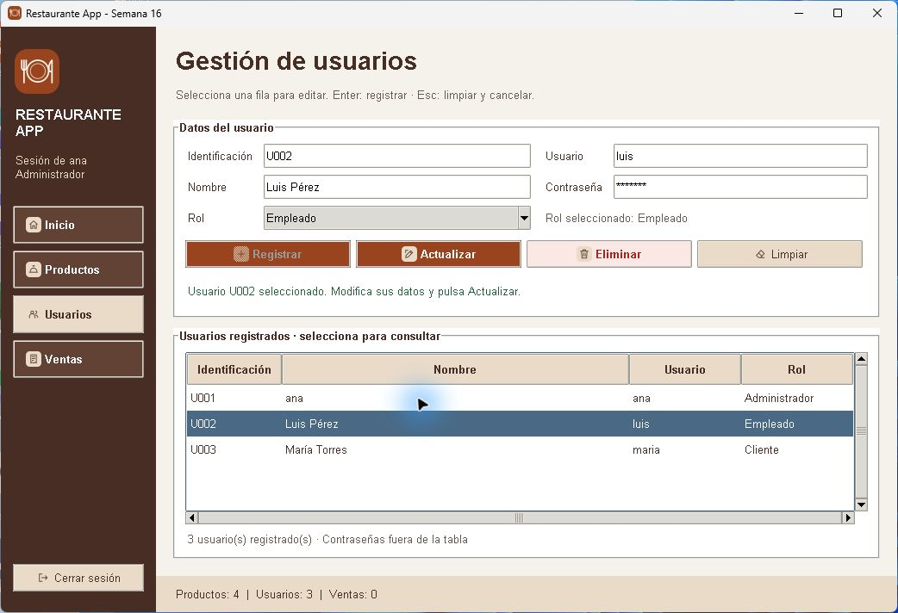

# Restaurante App · Semana 16

**Manejo de eventos aplicado a la gestión de usuarios con Tkinter**

| Información académica | Dato |
| --- | --- |
| Estudiante | Juan David Rivadeneira Cuascota |
| Universidad | Universidad Estatal Amazónica |
| Asignatura | Programación Orientada a Objetos |
| Docente | Kevin Bolívar Lascano Sánchez |
| Semestre y paralelo | Segundo semestre · F |
| Código del curso | 2626-UEA-L-UFB-030-F |
| Semana | 16 |

## Propósito

Esta versión continúa **restaurante_app de Semana 15**. Evoluciona Usuarios desde
una consulta en tabla hasta un formulario para registrar, consultar, actualizar
y eliminar empleados y clientes. Demuestra cómo una selección, una tecla o un
cambio de rol activan callbacks mediante `bind()`. Los botones conservan
`command=` y delegan las operaciones a `RestauranteServicio` y la persistencia JSON.



La captura es de esta versión ejecutada con **datos temporales de prueba**.
Luis y María ilustran los roles; no están precargados en la entrega. Se conserva
`U001 · ana`, ahora Administrador, los cuatro productos de Semana 15 y su archivo
de ventas original, inicialmente vacío.

## Ejecución y acceso

Requisitos: **Python 3.10 o superior con Tkinter** y un entorno gráfico.
Solo se usa la biblioteca estándar; no hay paquetes que instalar con pip.
Se verificó con **Python 3.14.3 en Windows**.

Desde la raíz del repositorio:

```bash
python restaurante_app/main.py
```

En Windows también funciona `py restaurante_app/main.py`. Dentro de
`restaurante_app`, ejecutar `python main.py`. Las rutas se calculan desde los
archivos del proyecto; el inicio no depende de la carpeta de la terminal.

**Acceso de demostración:** `ana` · contraseña `1234` · **Administrador**.
Son credenciales didácticas del proyecto, no una cuenta externa.

1. Iniciar sesión y abrir **Usuarios**.
2. Completar, por ejemplo: `U002`, `Luis Pérez`, `luis`, `demo123` y rol Empleado.
3. Pulsar **Registrar** o **Enter** desde un campo del formulario.
4. Seleccionar la fila: se cargan automáticamente los datos.
5. Modificar nombre, usuario, contraseña o rol y pulsar **Actualizar**.
6. Pulsar **Escape** o **Limpiar** para cancelar la selección y vaciar los campos.
7. Seleccionar un empleado o cliente y pulsar **Eliminar**; confirmar o cancelar.
8. Cerrar y ejecutar nuevamente: los cambios permanecen.

## Continuidad del proyecto

La base es la [Semana 15](https://github.com/DavidRivadeneira/POO-Semana-15-Restaurante),
commit **4522956**, conservado en el historial. Esa versión continúa las semanas
13 y 14. Se mantiene el dominio del restaurante y se modifica lo necesario para
evolucionar la gestión de usuarios.

| Elemento | Semana 15 | Semana 16 |
| --- | --- | --- |
| Arquitectura | datos, modelos, servicios, ui y main.py | Mismas capas y punto de entrada. |
| Inicio de sesión | LoginView y validación en servicio | Conservado; se identifica el rol y se limpia la sesión al salir. |
| Productos | Registrar, cargar por código, actualizar, eliminar y limpiar | Operaciones y datos conservados. |
| Ventas | Usuario + producto + fecha, tabla y JSON | Conservadas; selectores actualizados al entrar en la sección. |
| Usuarios | Consulta sin contraseñas en tabla | CRUD de empleados/clientes y carga automática del formulario. |
| Modelo Usuario | Identificación, nombre y credenciales | Se añade rol y conversión a diccionario. |
| Eventos | Botones con command | Se conservan; se añaden cuatro eventos con bind. |
| Diseño | Terracota y crema, menú, logo e íconos | Misma identidad; formulario sobre la tabla de usuarios. |

Productos, ventas, servicio de archivos, vista de acceso y recursos visuales
proceden de la versión anterior. Las ventas mantienen los nombres históricos
aunque luego se edite o elimine el usuario o producto. La venta sigue siendo
sencilla y **no modifica stock**, igual que en Semana 15.

## Estructura y responsabilidades

```text
Repositorio/
├── README.md
├── .gitignore
├── tests/
│   ├── test_restaurante.py
│   └── test_usuarios.py
├── docs/evidencias/
│   ├── usuarios.png           (Semana 16)
│   ├── login.png              (evidencia de Semana 15)
│   ├── productos.png          (evidencia de Semana 15)
│   └── ventas.png             (evidencia de Semana 15)
└── restaurante_app/
    ├── README.md
    ├── main.py
    ├── datos/
    │   ├── productos.json
    │   ├── usuarios.json
    │   └── ventas.json
    ├── modelos/
    │   ├── __init__.py
    │   ├── producto.py
    │   ├── usuario.py
    │   └── venta.py
    ├── servicios/
    │   ├── __init__.py
    │   ├── archivo_servicio.py
    │   └── restaurante_servicio.py
    ├── ui/
    │   ├── __init__.py
    │   ├── login_view.py
    │   ├── main_view.py
    │   └── recursos.py
    └── assets/
        ├── README.md
        ├── icons/             (diez íconos PNG y originales SVG)
        └── logo/              (logo.png, menu.png, icono.png y logo.svg)
```

| Capa | Responsabilidad |
| --- | --- |
| Modelos | Representar Producto, Usuario y Venta; validar el formato de sus atributos. |
| RestauranteServicio | Validar acceso, roles, duplicados y operaciones; mantener colecciones e índices; solicitar persistencia. |
| ArchivoServicio | Leer JSON y escribir con archivo temporal y reemplazo atómico. |
| Interfaz | Capturar entradas, atender eventos, llamar al servicio y actualizar formulario, tabla y mensajes. No lee ni escribe JSON. |
| main.py | Crear servicios y una ventana Tk; alternar vistas con un único mainloop. |
| assets y recursos.py | Mantener y cargar logo e íconos mediante PhotoImage. |

## Usuarios y roles

El modelo admite **Administrador, Empleado y Cliente**. La cuenta existente
`ana` conserva identificación y credenciales, y recibe explícitamente el rol
Administrador en `usuarios.json`.

- **Administrador:** puede usar Usuarios y gestionar empleados y clientes.
- **Empleado y Cliente:** pueden iniciar sesión, pero no ven Usuarios en el menú.
  Productos y Ventas conservan el comportamiento previo, sin permisos avanzados.
- El servicio también exige sesión administrativa para modificar usuarios;
  ocultar el botón no es la única comprobación.
- El selector solo permite Empleado y Cliente. No se crean administradores ni
  se promueven cuentas a ese rol desde esta pantalla.
- Las cuentas administrativas se consultan, pero sus controles de edición y
  eliminación están deshabilitados; el servicio también las protege.

El Treeview contiene **identificación, nombre, usuario y rol**. No contiene
contraseñas, ni siquiera en columnas ocultas o etiquetas. El identificador de fila
es la identificación del usuario; el callback consulta al servicio para obtener
el objeto y carga su contraseña en un Entry con `show="*"`.

La identificación queda de solo lectura al seleccionar. Actualizar utiliza la
clave seleccionada y reemplaza el objeto después de guardar, reconstruyendo los
índices. Así se puede cambiar el nombre de acceso sin dejar una entrada antigua.

Se rechazan campos vacíos, roles inválidos, identificaciones y nombres de acceso
duplicados y registros inexistentes. Eliminar conserva las ventas anteriores;
una identificación usada en ese historial no se reasigna a otra persona.

## bind(), command= y callbacks

Un **evento** representa lo ocurrido en un widget. Un **callback** es el método
que responde. `bind()` conecta un evento concreto con un callback que recibe
`event`; `command=` conecta la acción principal de un botón con un callback
sin ese parámetro automático. Se entrega el método **sin paréntesis**.

| Interacción | Asociación | Callback | Respuesta |
| --- | --- | --- | --- |
| Seleccionar fila | `bind("<<TreeviewSelect>>", ...)` | `al_seleccionar_usuario(event)` | Recupera la identificación, consulta al servicio y carga el formulario. |
| Enter en campos o selector | `bind("<Return>", ...)` | `al_presionar_enter(event)` | Reutiliza registrar_usuario(). |
| Escape en campos, selector, tabla o botones de Usuarios | `bind("<Escape>", ...)` | `al_presionar_escape(event)` | Reutiliza limpiar_formulario_usuario(). |
| Elegir rol | `bind("<<ComboboxSelected>>", ...)` | `al_seleccionar_rol(event)` | Actualiza «Rol seleccionado». |
| Pulsar botón | `command=metodo` | Registrar / Actualizar / Eliminar / Limpiar | Ejecuta la acción y presenta el resultado. |

Ejemplo real de reutilización:

```python
def al_presionar_enter(self, event):
    self.registrar_usuario()
    return "break"
```

El botón Registrar llama al mismo método. No se duplican validaciones ni
escrituras en el callback de teclado. `"break"` evita propagar el atajo.
Los bindings son locales a Usuarios y desaparecen al cambiar de sección;
no se utiliza `bind_all()`.

Enter registra un usuario nuevo: si hay una selección, se indica usar Limpiar
o Escape primero. **Actualizar requiere su botón**, evitando confundir registro
y edición. Escape vacía campos, restaura Cliente, cancela selección, restablece
botones y devuelve el foco a Identificación. Los errores conservan el formulario
para corregirlo o reintentar.

```text
Inicio → LoginView → RestauranteServicio valida acceso → MainView
  → Administrador abre Usuarios → selecciona fila
  → <<TreeviewSelect>> → bind() → callback(event)
  → identificación → servicio busca Usuario → formulario
  → Actualizar / Eliminar → servicio valida → usuarios.json
  → tabla y contador actualizados → respuesta visual
```

## Persistencia

Al iniciar se leen los tres JSON. Cada operación de usuarios guarda la colección
completa y, solo después de escribir correctamente, confirma memoria e índices.
Un fallo de escritura no produce confirmaciones ni filas ficticias. Los errores
de lectura se informan sin sustituir los archivos por listas vacías.

El usuario inicial conserva sus datos anteriores y añade `rol`:

```json
{
    "identificacion": "U001",
    "nombre": "ana",
    "usuario": "ana",
    "contrasena": "1234",
    "rol": "Administrador"
}
```

Un registro antiguo sin rol se interpreta como Cliente, sin otorgarle permisos
administrativos automáticamente. La entrega ya incluye el rol explícito de ana.
Las carpetas de semanas anteriores conservan sus propios datos.

El almacenamiento de contraseñas sigue siendo didáctico en JSON. `show="*"`
solo oculta los caracteres en pantalla. Conforme a la consigna, no se implementan
cifrado, bloqueo o suspensión de cuentas, recuperación de contraseña, bases de
datos, Supabase ni administración compleja de permisos.

## Interfaz y recursos visuales

Se conservan la paleta terracota y crema, menú lateral, estilos ttk, tablas con
desplazamiento y pie con cantidades. Usuarios organiza los campos en dos columnas
y mantiene la tabla debajo. Los botones se habilitan según la selección.

La ventana inicia en **1040 × 680**, con mínimo **940 × 620**. Se comprobó que
los controles de Usuarios, Productos y Ventas permanezcan visibles en ese tamaño.
**assets/** conserva el logo de plato y cubiertos y diez íconos utilizados por
la interfaz. Se mantienen las referencias PhotoImage para que no desaparezcan;
no se necesitan descargas ni conversión de SVG al ejecutar.

## Comprobación de funcionamiento

Las **32 pruebas automatizadas pasaron** con Python 3.14.3 en Windows: 18
conservadas y adaptadas de Semana 15 y 14 nuevas para Usuarios. Usan copias
temporales, botones Tkinter con `invoke()` y eventos con `event_generate()` y
procesamiento del bucle de Tkinter. Se intercepta la confirmación de eliminación
para comprobar tanto aceptar como cancelar. Requieren un entorno gráfico.

```bash
python -B -m unittest discover -s tests -v
```

También se revisó visualmente la pantalla y se comprobó mediante interacción
directa la selección de filas y Escape. La captura superior documenta esa revisión.

| Comprobación mínima de la consigna | Resultado verificado |
| --- | --- |
| 1. Inicio | Aplicación inicia, incluso desde otra carpeta. |
| 2. Login, navegación, Productos y Ventas | Acceso, salida, CRUD de productos y ventas conservados. |
| 3. Administrador | Menú y formulario de Usuarios disponibles. |
| 4. Empleado y Cliente | Sin menú; acceso directo y operaciones administrativas rechazados. |
| 5–6. Registro y tabla | Ambos roles; fila y contador actualizados. |
| 7. Selección | Consulta por identificación y carga automática sin contraseña en tabla. |
| 8. Actualización | Datos e índices de acceso conservados al recargar. |
| 9. Eliminación | Cancelar conserva; confirmar elimina del JSON y la tabla. |
| 10. Cuenta administrativa | Protegida en interfaz y servicio. |
| 11. Enter | Ejecuta una vez el mismo registro del botón. |
| 12. Escape | Limpia campos y selección; restaura foco y rol inicial. |
| 13. Combobox | El evento actualiza el texto del rol elegido. |
| 14. Reinicio | Una nueva instancia recupera los usuarios guardados. |
| 15. Presentación | Controles visibles en tamaño mínimo, diseño consistente y assets integrados. |

Además se verifican duplicados, datos inválidos, fallos de escritura sin cambios
parciales, historial y ausencia de atajos de Usuarios en otras secciones.
Para repetir manualmente registros sin cambiar los datos iniciales, usar una
copia de la carpeta del proyecto.

## Correspondencia con la rúbrica

| Criterio | Evidencia implementada |
| --- | --- |
| Evolución, arquitectura y reutilización (2 puntos) | Base 4522956, historial anterior, capas conservadas y callbacks que reutilizan operaciones. |
| Gestión de usuarios y roles (2 puntos) | CRUD, tres roles, control administrativo y usuarios.json mediante el servicio. |
| Manejo de eventos (2 puntos) | Cuatro eventos con bind, callbacks con event y botones con command. |
| Interfaz y experiencia (2 puntos) | Formulario, tabla, navegación, mensajes, atajos, logo e íconos desde assets. |
| Documentación (2 puntos) | Propósito, continuidad, estructura, roles, eventos, persistencia, ejecución y pruebas. |

La tabla identifica las evidencias; la calificación corresponde al docente.

## Referencias consultadas y entrega

- [Consigna y rúbrica Semana 16](https://eva.pregrado.uea.edu.ec/eva2626/web/mod/assign/view.php?id=1119590).
- [Guía de estudio Semana 16](https://eva.pregrado.uea.edu.ec/eva2626/web/mod/resource/view.php?id=1119575).
- [Presentación Semana 16](https://eva.pregrado.uea.edu.ec/eva2626/web/mod/resource/view.php?id=1119576).
- [Repositorio docente Semana 16](https://github.com/kevin10lascano-sketch/Clase-Semana-16-POO),
  revisión **8c20ba9**. Se ejecutaron acceso, registro con Enter, rol, selección,
  edición, Escape y recarga sobre datos temporales.
- [Explorador de eventos Semana 16.1](https://github.com/kevin10lascano-sketch/Clase-Semana-16.1-POO),
  revisión **624dab7**. Se ejecutaron inicio, eventos de selección y ejemplo command/bind.

Los ejemplos docentes de biblioteca se usaron como referencia de interacción,
adaptando el comportamiento al restaurante y conservando código, modelos, datos,
guardado atómico e identidad visual de las semanas anteriores.

**Repositorio de entrega:**
[POO-Semana-16-Restaurante](https://github.com/DavidRivadeneira/POO-Semana-16-Restaurante).

En EVA se entrega únicamente el enlace del repositorio **público**, que incluye
proyecto, los tres JSON, interfaz, recursos visuales y README.
